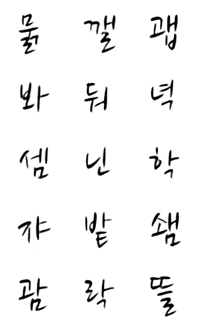
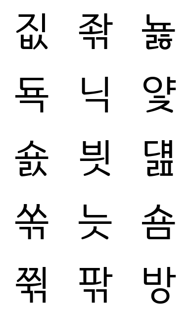
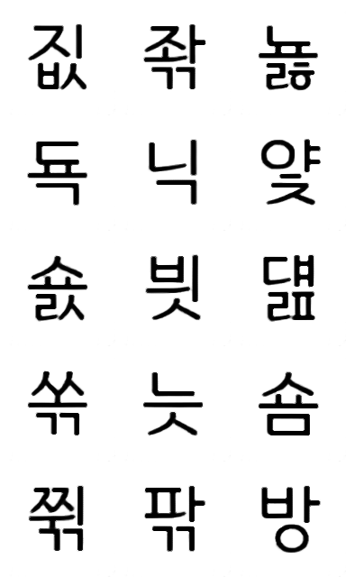

# Neural-fonts - GAN을 활용한 한글 폰트 제작 프로젝트

<p align="center">
  
</p>

GAN을 사용하여 한글 폰트를 자동으로 만들어 주는 프로젝트입니다. 

디자이너가 399자만 만들면 딥러닝을 통해서 해당 폰트의 style 정보를 훈련하여 11,172자의 완성형 한글을 생성합니다.

중국 폰트를 생성하는 [zi2zi](https://github.com/kaonashi-tyc/zi2zi)를 한글에 맞게 수정하여 사용하였습니다.

## Gallery
### 필기체 (나눔 붓 폰트)

<table>
  <tr>
    <td><p align="center"><b>Original<b/></p></td>
    <td><p align="center"><b>Generated<b/></p></td>
  </tr>
  <tr>
    <td></td>
    <td></td>
  </tr>
</table>

### 고딕체 (푸른전남 폰트)

<table>
  <tr>
    <td><p align="center"><b>Original<b/></p></td>
    <td><p align="center"><b>Generated<b/></p></td>
  </tr>
  <tr>
    <td></td>
    <td></td>
  </tr>
</table>

## Overview

399자에 대해서만 training을 할 경우 완성형 한글의 글자수에 비해서 input 개수가 부족합니다.

이를 해결하기 위해서 먼저 다양한 한글 폰트에 대해서 training한 model을 생성합니다.

생성된 model에 transfer learning을 통해서 399자를 training하고 이를 사용하여 폰트를 생성합니다.

## 사용법
### Requirement
* Python 2.7
* CUDA
* cudnn
* Tensorflow >= 1.0.1
* Pillow(PIL)
* numpy >= 1.12.1
* scipy >= 0.18.1
* imageio

### Create of download pre-trained model

먼저 한글 폰트에 대해서 training 된 model을 생성합니다.

32개의 copyleft font에 대하여 pre-train된 model을 다운받아서 사용하거나 원하는 폰트를 사용하여 직접 training을 할 수 있습니다.

> [Pre-trained Model](https://mysnu-my.sharepoint.com/personal/yu65789_seoul_ac_kr/_layouts/15/guestaccess.aspx?docid=0a7fcfabb78af4958b790b98eccac135c&authkey=AVqeaI5jyQHWyklZgotc04Y)

새로 training을 할 경우 [zi2zi](https://github.com/kaonashi-tyc/zi2zi)의 readme를 참조하여 training을 수행하면 됩니다.

### Training Data 생성

먼저 [font template](template/TemplateKR.pdf)을 다운받아서 인쇄후 칸에 맞춰서 글자를 작성합니다.

작성한 template을 scan한 다음 그림판 등을 사용하여 여백 부분을 잘라냅니다.

잘라낸 image를 페이지 순서대로 `1-uniform.png`, `2-uniform.png`, `3-uniform.png`로 이름을 변경합니다.

아래 명령어를 사용하여 폰트 image들을 생성합니다.

```sh
python crop.py --src_dir=src_dir
               --dst_dir=dst_dir
```

dst_dir에 각 글자의 unicode를 파일명으로 하는 폰트 image들이 생성됩니다.

### Preprocessing

IO bottleneck을 막기 위해서 preprocessing을 거쳐 binary를 생성한 다음 사용합니다.

아래 명령어를 실행하여 source font와 handwritten font가 합쳐진 training을 위한 font image를 생성합니다.

```sh
python font2img.py --src_font=src.ttf
                   --dst_font=src.ttf
                   --sample_count=1000
                   --sample_dir=sample_dir
                   --label=0
                   --handwriting_dir=handwriting_dir
```
sample_dir은 training을 위한 font image가 저장 될 폴더입니다.
handwriting_dir option을 사용하여 template을 통해 생성한 폰트 image 폴더를 알려줍니다.
Label option은 category embedding에서의 font index를 나타내며 기본값은 0입니다. 여러개의 폰트를 training하고 싶은 경우 각각의 폰트에 다른 label을 할당하면 됩니다.

Image들의 생성이 완료되었으면 **package.py**를 실행하여 image를 묶어서 binary format으로 만듭니다.

```sh
python package.py --fixed_sample=1
                  --dir=image_directory
                  --save_dir=binary_save_directory
```

명령어를 실행하면 **train.obj**가 save_dir에 생성됩니다. 해당 파일이 training을 위해 사용되는 data입니다.

### Experiment Layout
```sh
experiment/
└── data
    └── train.obj
```

Root 폴더 밑에 폰트를 위한 폴더를 생성한 다음 앞에서 생성 한 binary 파일을 data 폴더 밑으로 옮깁니다. 

### Train

Training은 두 단계로 첫 번째 training과 fine-tuning으로 나뉩니다.

아래의 명령어를 실행하여 training을 수행합니다.

**Step 1**
```sh
python train.py --experiment_dir=experiment 
                --experiment_id=0
                --batch_size=16 
                --lr=0.001
                --epoch=30 
                --sample_steps=100 
                --schedule=10 
                --L1_penalty=100 
                --Lconst_penalty=15
```

**Step 2**
```sh
python train.py --experiment_dir=experiment 
                --experiment_id=0
                --batch_size=16 
                --lr=0.001
                --epoch=120 
                --sample_steps=100 
                --schedule=40 
                --L1_penalty=500 
                --Lconst_penalty=1000
```

### Inference

Training이 끝난 후 아래 명령어를 통해 inference를 수행합니다.

```sh
python infer.py --model_dir=checkpoint_dir/ 
                --batch_size=16 
                --source_obj=binary_obj_path 
                --embedding_ids=label[s] of the font, separate by comma
                --save_dir=save_dir/
```

## Acknowledgements
Code derived and rehashed from:
* [zi2zi](https://github.com/kaonashi-tyc/zi2zi) by [kaonashi-tyc](https://github.com/kaonashi-tyc)

## License
[MIT License](https://raw.githubusercontent.com/JohnCoates/Aerial/master/LICENSE)
